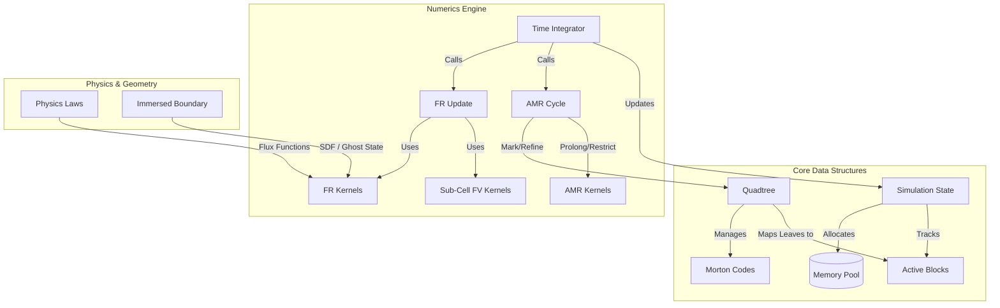

# Architecture

This document outlines the architectural design of Pazuzu, transitioning from a generic unstructured DG solver to a specialized **Cartesian Quadtree** solver using **Flux Reconstruction (FR)** and **Block-Adaptive Mesh Refinement (AMR)**.

## System Diagram

## 1. Core Architecture

### A. Mesh Topology: Cartesian Quadtree
The solver utilizes a hierarchical Quadtree structure for managing the computational grid.
*   **Structure:** Uses **Morton Encoding (Z-ordering)** for fast spatial indexing, optimized for GPU performance.
*   **Connectivity:** Explicit neighbor lists are replaced by implicit connectivity defined by parent/child relationships in the tree.
*   **AMR Strategy:** Employing **Block-based refinement**. A global "Memory Pool" of fixed-size blocks (e.g., $8 \times 8$ or $16 \times 16$ cells) is pre-allocated. Active leaf nodes in the quadtree map directly to slots in this memory pool.

### B. Numerical Method: Flux Reconstruction (FR)
*   **Formulation:** Solves the conservation laws in Differential Form:
    $$ \frac{\partial f}{\partial x} + g_{corr} $$
*   **Basis:** Uses a **Gauss-Lobatto-Legendre (GLL)** nodal basis (Tensor Product).
*   **Correction Functions:** Utilizes Radau or Legendre polynomials (e.g., Huynh's $g_2$) to recover high-order accuracy ($P > 0$).
*   **Shock Capturing:** Implements a hybrid **Sub-Cell Finite Volume** method. Blocks identified as "troubled" (containing shocks or discontinuities) switch from the high-order FR scheme to a robust, first-order Finite Volume update on the sub-grid nodes.

### C. Geometry: Immersed Boundary Method (IBM)
*   **Representation:** Geometry is represented using **Signed Distance Fields (SDF)**.
*   **Boundary Handling:** Uses Ghost-cell forcing or cut-cell integration techniques. This eliminates the need for complex, body-fitted mesh generation.

---

## 2. Project Structure

The codebase is organized to support the block-structured AMR paradigm:

*   **`config/`**: YAML configuration files, including AMR and IBM settings.
*   **`src/core/`**: Core data structures.
    *   `basis.py`: GLL nodes, weights, and Correction Polynomials.
    *   `simulation_state.py`: Manages the global Memory Pool (`MAX_BLOCKS`).
*   **`src/geometry/`**: Grid management.
    *   `quadtree.py`: Handles Morton encoding and Refinement/Coarsening logic.
    *   `ibm.py`: Manages Level-set / Signed Distance Fields.
*   **`src/physics/`**: Physics definitions.
    *   `laws/`: Pure physics implementations (Euler/Navier-Stokes flux functions).
*   **`src/numerics/`**: Numerical schemes.
    *   `flux_reconstruction.py`: Derivatives of 1D Correction functions.
    *   `time_steppers.py`: Time integration schemes (SSP-RK3, RK4).
*   **`src/kernels/`**: Computational kernels (optimized for block iteration).
    *   `fr_kernels.py`: Differential form FR update.
    *   `amr_kernels.py`: Inter-block interpolation (Prolongation/Restriction).
    *   `fv_kernels.py`: Sub-cell Finite Volume update for shock capturing.
    *   `boundary_conditions.py`: Riemann and Slip boundary conditions.
*   **`src/io/`**: I/O modules, updated for Block-Structured HDF5 data.

---

## 3. Implementation Roadmap

The development follows a phased approach:

### Phase 1: The Foundation (Quadtree & Memory)
*   Establish grid data structures without physics.
*   Implement Quadtree class (Morton codes, uniform refinement).
*   Implement SimulationState with Memory Pool allocation.

### Phase 2: Flux Reconstruction (Static Grid)
*   Run physics on a uniform, non-adaptive grid.
*   Implement 1D Correction Polynomial derivatives.
*   Write differential form FR kernels.

### Phase 3: Adaptive Mesh Refinement (AMR)
*   Enable dynamic hanging-node refinement.
*   Implement P-Multigrid kernels (Interpolation).
*   Handle Mortar Interfaces (2:1 balance).
*   Implement the Mark -> Refine -> Balance loop.

### Phase 4: Robustness (Sub-Cell FV)
*   Enable shock capturing.
*   Implement "Troubled Cell" detectors (e.g., Persson-Peraire).
*   Write first-order Godunov kernels for sub-grids.

### Phase 5: Immersed Boundary Method (IBM)
*   Support complex geometry.
*   Load/Generate Signed Distance Fields (SDF).
*   Implement Ghost-Node forcing kernels.
